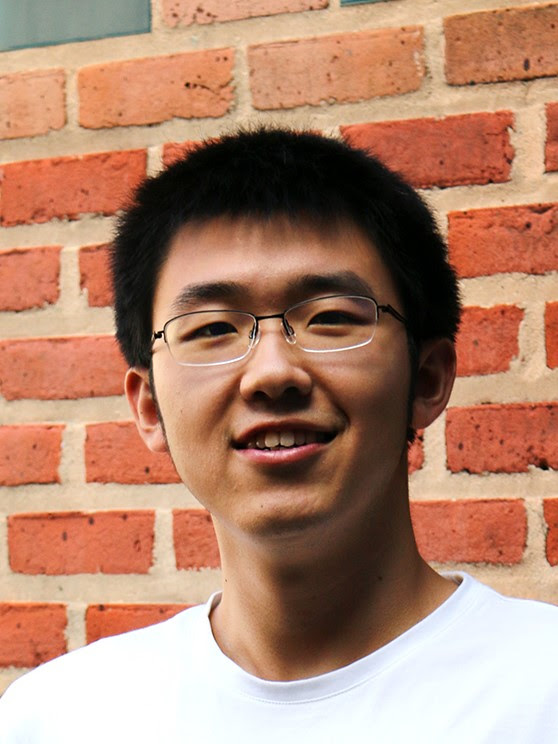

**Shengchao Lin**

[Department of Computational and Applied Mathematics](https://www.caam.rice.edu/)
, [Rice University](https://www.rice.edu/)

My research is concerned with mainly the design and analysis of mathematical optimization algorithms. Specific research
areas include optimal control of partial differential equations, parallel method for training recurrent neural network.

You can find my [CV](files/Shengchao_Lin_CV.pdf) here.

### Contact Info

- **Office**: Duncan Hall 2118, Rice University
- **Email**: shengchao.lin@rice.edu

### Education

- **Ph.D. Candidate** (2017.08 - Present)
    - [Department of Computational and Applied Mathematics](https://www.caam.rice.edu/)
      , [Rice University](https://www.rice.edu/)
    - **Advisor**: [Matthias Heinkenschloss](http://www.caam.rice.edu/~heinken/)

- **M.A.** (December, 2019)
    - [Department of Computational and Applied Mathematics](https://www.caam.rice.edu/)
      , [Rice University](https://www.rice.edu/)
    - **Thesis**: *Parareal-Based Preconditioners for Linear-Quadratic Optimal Control Problems*
    - **Advisor**: [Matthias Heinkenschloss](http://www.caam.rice.edu/~heinken/)

- **B.S.** (July, 2017)
    - [School of Mathematical Sciences](http://www.math.pku.edu.cn/en)
      , [Peking University](http://english.pku.edu.cn/)

### Previous Research

- Wind power forecasting for wind farms
  **Advisor**: [Zaiwen Wen](http://bicmr.pku.edu.cn/~wenzw)
  , [Pingwen Zhang](http://www.math.pku.edu.cn/teachers/zhangpw/private/homepage/ )
- Structured linearization and algorithms for gyroscopic and palindromic eigenvalue problems
  **Advisor**: [Yunfeng Cai](http://dsec.pku.edu.cn/~yfcai/ )

### Others

- I am co-organized a [reading group](reading_group.md) covering topics from applied mathematics.